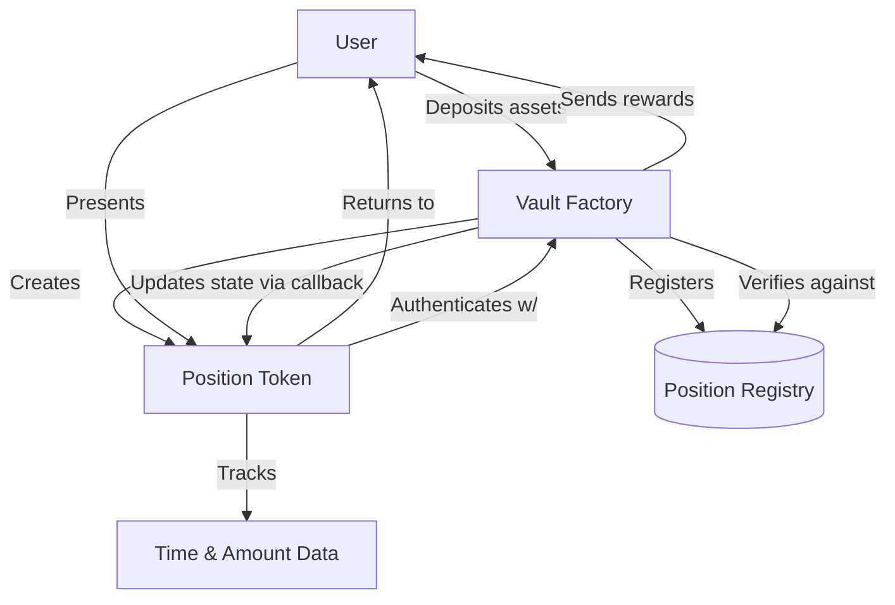
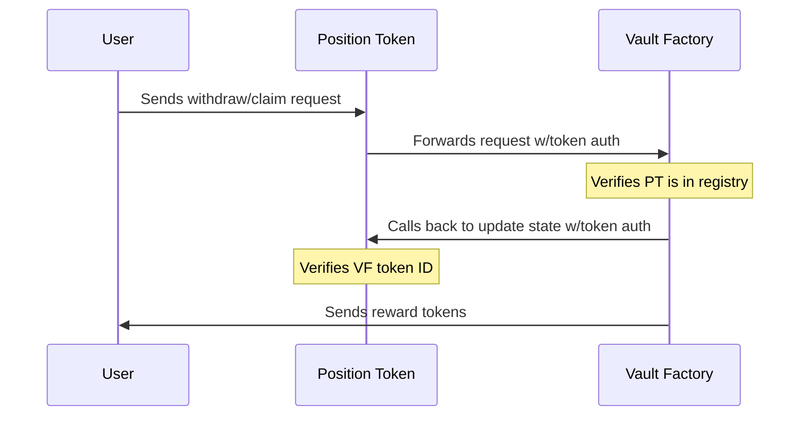
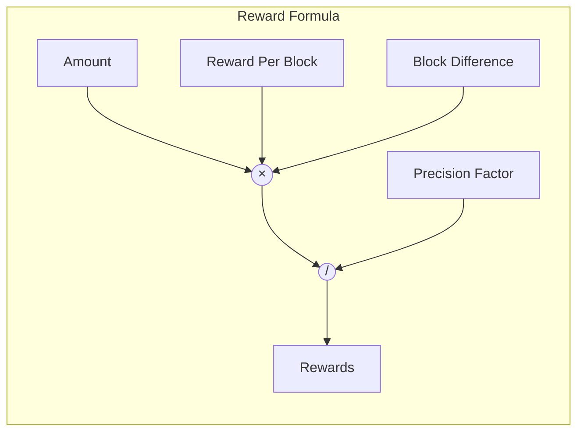
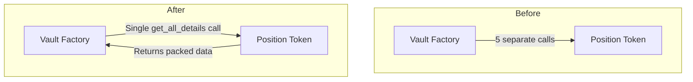
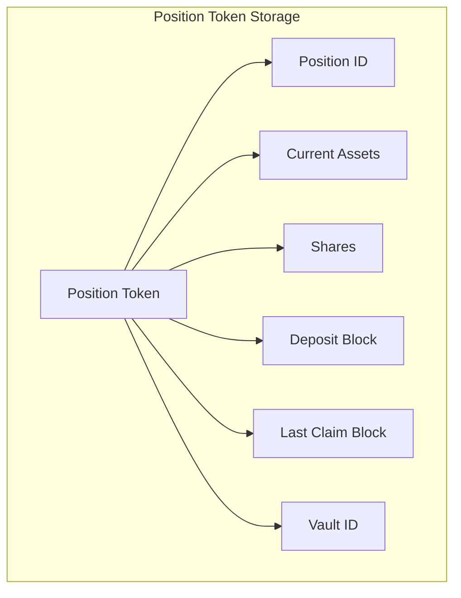

# Vault Factory Architecture

This document provides a visual overview of the vault factory architecture and its interaction patterns with position tokens.

## Contract Relationship Diagram

## Authentication Flow

## Reward Calculation

## Data Flow Optimization

## Position Token Storage

This architecture follows the factory-child pattern found in the Alkane Pandas project but adapted for a reward vesting system.
