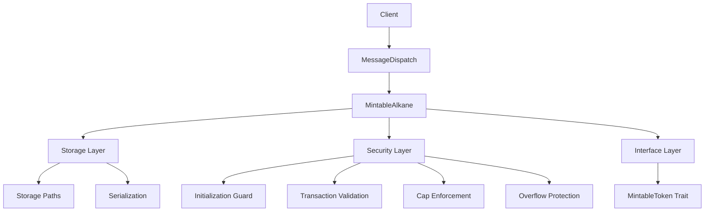

# Bitcoin Smart Contract Project Brief

## Executive Summary

The Bitcoin Smart Contract project provides a robust architecture and implementation patterns for creating secure token contracts on Bitcoin using WebAssembly. It follows the Alkanes framework with a focus on security, standardization, and developer experience. The architecture enables tokens with free mint capabilities while enforcing security constraints such as initialization guards, transaction replay protection, and supply caps.

## Architectural Vision

The project follows these core architectural principles:

1. **Security First**: All patterns prioritize security above other concerns
2. **Clear Interfaces**: Standardized interfaces promote interoperability
3. **Modular Design**: Components have clear responsibilities and constraints
4. **Developer Experience**: Patterns are designed for clarity and maintainability
5. **Bitcoin Compatibility**: All designs consider Bitcoin's unique constraints

## Key Components

### Core Components




### Component Descriptions

**Client Layer**: External clients that interact with the contract through opcodes

**MessageDispatch**: Routes opcodes to appropriate handler functions, manages parameter serialization

**MintableAlkane**: Core contract implementation that handles token operations

**Storage Layer**: Manages persistent state using storage pointers

**Security Layer**: Implements security patterns for contract protection

**Interface Layer**: Defines standardized interfaces for contract interaction

## File Structure

```
bitcoin-smart-contract/
├── Cargo.toml               # Project dependencies
├── build.rs                 # Build script for WASM compilation
├── src/
│   ├── lib.rs               # Main contract implementation with MessageDispatch
│   ├── constants.rs         # Constants for opcodes and storage paths
│   └── factory.rs           # Factory trait implementation
├── tests/
│   ├── integration_test.rs  # Integration tests
│   └── security_test.rs     # Security-focused tests
└── scripts/
    ├── wasm-build.sh        # Build script for WebAssembly
    └── deploy.js            # Deployment script
```

## Development Workflow

### 1. Setup Development Environment

```bash
# Install Rust and WebAssembly target
curl --proto '=https' --tlsv1.2 -sSf https://sh.rustup.rs | sh
rustup target add wasm32-unknown-unknown

# Install wasm-opt
npm install -g wasm-opt

# Clone the repository
git clone https://github.com/example/bitcoin-smart-contract.git
cd bitcoin-smart-contract
```

### 2. Implement Contract Logic

```rust
// Core implementation in lib.rs
#[derive(MessageDispatch)]
enum MintableAlkaneMessage {
    #[opcode(0)]
    Initialize { 
        units: u8, 
        value_per_mint: u128,
        cap: u128, 
        name: String, 
        symbol: String 
    },
    
    // Add additional operations...
}

// Implement handlers
fn handle_initialize(
    &mut self, 
    units: u8, 
    value_per_mint: u128,
    cap: u128, 
    name: String, 
    symbol: String
) -> Result<(), &'static str> {
    // Implementation...
}
```

### 3. Build for WebAssembly

```bash
# Build for WebAssembly
./scripts/wasm-build.sh
```

### 4. Test Contract

```bash
# Run unit tests
cargo test

# Run integration tests
cargo test --test integration_test
```

### 5. Deploy and Initialize

```bash
# Deploy the contract
node scripts/deploy.js

# Initialize the contract
node scripts/initialize.js \
  --name "Example Token" \
  --symbol "EXT" \
  --units 18 \
  --value-per-mint 1000 \
  --cap 1000000
```

## Getting Started Guide

### Step 1: Create a New Project

```bash
# Create project directory
mkdir my-bitcoin-token
cd my-bitcoin-token

# Initialize Cargo project
cargo init --lib
```

### Step 2: Configure Dependencies

Add to Cargo.toml:

```toml
[package]
name = "my-bitcoin-token"
version = "0.1.0"
edition = "2021"

[lib]
crate-type = ["cdylib", "rlib"]

[dependencies]
alkanes-support = "0.1.0"
alkanes-runtime = "0.1.0"
metashrew-support = "0.1.0"
protorune-support = "0.1.0"
alkane-factory-support = "0.1.0"
serde = { version = "1.0", features = ["derive"] }
serde_json = "1.0"

[features]
default = []
blockchain = ["alkanes-runtime/blockchain", "alkanes-support/blockchain"]
```

### Step 3: Implement Core Contract

Create lib.rs:

```rust
use alkanes_support::*;
use std::collections::HashSet;
use serde_json;

// Define message structure
#[derive(MessageDispatch)]
enum MyTokenMessage {
    #[opcode(0)]
    Initialize { 
        units: u8, 
        value_per_mint: u128,
        cap: u128, 
        name: String, 
        symbol: String 
    },
    
    // Additional operations...
}

// Implement contract
pub struct MyToken {}

impl Default for MyToken {
    fn default() -> Self {
        Self {}
    }
}

// Implement handlers
impl MyToken {
    fn handle_initialize(
        &mut self, 
        units: u8, 
        value_per_mint: u128,
        cap: u128, 
        name: String, 
        symbol: String
    ) -> Result<(), &'static str> {
        // Implementation...
        Ok(())
    }
    
    // Additional handlers...
}
```

### Step 4: Implement Security Patterns

Add to lib.rs:

```rust
impl MyToken {
    fn observe_initialization(&self) -> Result<(), &'static str> {
        if storage::get_bool("/initialized").unwrap_or(false) {
            return Err("Already initialized");
        }
        storage::set_bool("/initialized", true);
        Ok(())
    }
    
    fn validate_and_track_transaction(&self, tx_hash: &str) -> Result<(), &'static str> {
        // Implementation...
        Ok(())
    }
    
    // Additional security patterns...
}
```

### Step 5: Implement Storage Patterns

Add to lib.rs:

```rust
impl MyToken {
    fn name(&self) -> String {
        storage::get_string("/name").unwrap_or_default()
    }
    
    fn symbol(&self) -> String {
        storage::get_string("/symbol").unwrap_or_default()
    }
    
    // Additional storage patterns...
}
```

### Step 6: Build and Deploy

Create wasm-build.sh:

```bash
#!/bin/bash
RUSTFLAGS='-C link-arg=-s' cargo build --target wasm32-unknown-unknown --release --features "blockchain"
wasm-opt -Oz -o my_token_opt.wasm target/wasm32-unknown-unknown/release/my_bitcoin_token.wasm
cp my_token_opt.wasm my_token.wasm
```

## Key Resources

- [Alkanes Framework Documentation](https://example.com/alkanes-docs) (example link)
- [MessageDispatch Macro Guide](https://example.com/message-dispatch) (example link)
- [Bitcoin WebAssembly Best Practices](https://example.com/wasm-best-practices) (example link)
- [Security Patterns for Bitcoin Contracts](https://example.com/security-patterns) (example link)

## Contact and Community

- GitHub Repository: [github.com/example/bitcoin-smart-contract](https://github.com/example/bitcoin-smart-contract) (example link)
- Discord: [discord.gg/bitcoin-smart-contracts](https://discord.gg/bitcoin-smart-contracts) (example link)
- Documentation: [docs.bitcoin-smart-contracts.org](https://docs.bitcoin-smart-contracts.org) (example link)
- Issues and Feature Requests: [github.com/example/bitcoin-smart-contract/issues](https://github.com/example/bitcoin-smart-contract/issues) (example link)
