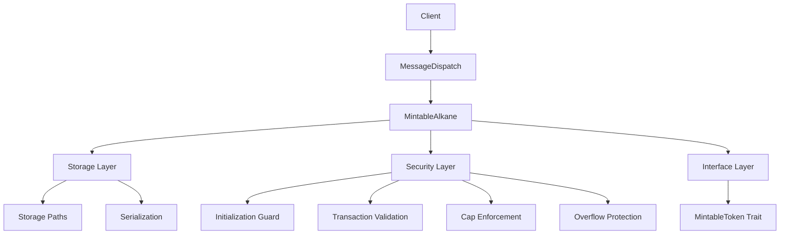

Bitcoin Smart Contract Project Brief

## Executive Summary

The Bitcoin Smart Contract project provides a robust architecture and implementation patterns for creating secure token contracts on Bitcoin using WebAssembly. It follows the Alkanes framework with a focus on security, standardization, and developer experience. The architecture enables tokens with free mint capabilities while enforcing security constraints such as initialization guards, transaction replay protection, and supply caps. The contract has been successfully built for WebAssembly target using a custom fork approach for Apple Silicon compatibility and deployed to OylNet for testing.

## Architectural Vision

The project follows these core architectural principles:

1. **Security First**: All patterns prioritize security above other concerns
2. **Clear Interfaces**: Standardized interfaces promote interoperability
3. **Modular Design**: Components have clear responsibilities and constraints
4. **Developer Experience**: Patterns are designed for clarity and maintainability
5. **Bitcoin Compatibility**: All designs consider Bitcoin's unique constraints
6. **Cross-Platform Support**: Build infrastructure works on all platforms, including Apple Silicon
7. **Network Readiness**: Contract interfaces are designed for OylNet compatibility

## Key Components

### Core Components




### Component Descriptions

**Client Layer**: External clients that interact with the contract through opcodes

**MessageDispatch**: Routes opcodes to appropriate handler functions, manages parameter serialization

**MintableAlkane**: Core contract implementation that handles token operations

**Storage Layer**: Manages persistent state using storage pointers

**Security Layer**: Implements security patterns for contract protection

**Interface Layer**: Defines standardized interfaces for contract interaction

**Dependency Fork**: Custom implementation for cross-platform compatibility, especially Apple Silicon

**Network Integration**: OylNet deployment and interaction infrastructure

## File Structure

```
bitcoin-smart-contract/
├── Cargo.toml               # Project dependencies
├── build.rs                 # Build script for WASM compilation
├── src/
│   ├── lib.rs               # Main contract implementation with MessageDispatch
│   ├── constants.rs         # Constants for opcodes and storage paths
│   ├── security/            # Security-focused modules
│   ├── storage/             # Storage management modules
│   ├── asset_management/    # Asset management implementation
│   └── utils/               # Utility functions and helpers
├── fork-repos/
│   └── secp256k1-sys/       # Custom fork for Apple Silicon compatibility
│       ├── Cargo.toml       # Fork manifest
│       ├── build.rs         # Fork build script
│       └── src/lib.rs       # Stub implementation
├── memory-bank/             # Documentation and project materials
├── tests/
│   ├── integration_test.rs  # Integration tests
│   └── security_test.rs     # Security-focused tests
└── scripts/
    ├── final_fork_build.sh  # Build script with fork integration
    ├── deploy_to_oylnet.sh  # OylNet deployment script
    ├── test_oylnet_connection.sh # Network connection verification
    └── interact_with_vault.sh # Contract interaction script
```

## Development Workflow

### 1. Setup Development Environment

```bash
# Install Rust and WebAssembly target
curl --proto '=https' --tlsv1.2 -sSf https://sh.rustup.rs | sh
rustup target add wasm32-unknown-unknown

# For Mac M1/M2/M3 (Apple Silicon): Install LLVM via Homebrew
arch -x86_64 /bin/bash -c "$(curl -fsSL https://raw.githubusercontent.com/Homebrew/install/master/install.sh)"
arch -x86_64 /usr/local/bin/brew install llvm
export PATH="/usr/local/opt/llvm/bin:$PATH"

# Clone the repository
git clone https://github.com/example/bitcoin-smart-contract.git
cd bitcoin-smart-contract
```

### 2. Build with Apple Silicon Compatibility

```bash
# For standard systems
./scripts/build_contracts.sh

# For Apple Silicon systems
./scripts/final_fork_build.sh
```

### 3. Deploy to OylNet

```bash
# Test OylNet connection
./scripts/test_oylnet_connection.sh

# Deploy contract
./scripts/deploy_to_oylnet.sh

# Interact with contract
./scripts/interact_with_vault.sh
```

### 4. Implement Contract Logic

```rust
// Core implementation in lib.rs
#[derive(MessageDispatch)]
enum MintableAlkaneMessage {
    #[opcode(0)]
    Initialize {
        units: u8,
        value_per_mint: u128,
        cap: u128,
        name: String,
        symbol: String
    },

    // Add additional operations...
}

// Implement handlers
fn handle_initialize(
    &mut self,
    units: u8,
    value_per_mint: u128,
    cap: u128,
    name: String,
    symbol: String
) -> Result<(), &'static str> {
    // Implementation...
}
```

### 5. Test Contract

```bash
# Run unit tests
cargo test

# Run integration tests
cargo test --test integration_test

# Test OylNet integration
./scripts/interact_with_vault.sh
```

## OylNet Deployment Configuration

### Required Environment Variables

Create a .env file with:
```
# OylNet deployment configuration
PROVIDER=oylnet
NETWORK=regtest
API_KEY=your_api_key_here
```

### Deployment Parameters

Set initialization parameters in deploy_to_oylnet.sh:
```bash
VAULT_NAME="YieldVault"
VAULT_SYMBOL="YVT"
ASSET_NAME="Bitcoin"
ASSET_SYMBOL="BTC"
DECIMALS="8"
```

### Network Integration

The contract has been successfully deployed to OylNet with transaction ID:
`c70dcaec55f6a8c05532fb4f6c2f2c2630f55337dd0c37de4ce3711a7c49fd19`

The following operations are verified working:
- GetName (opcode 100)
- GetSymbol (opcode 101)
- GetDecimals (opcode 102)
- GetAssetName (opcode 103)
- GetTotalAssets (opcode 200)
- GetTotalSupply (opcode 601)
- UpdateYield (opcode 900)

## Custom Dependency Fork for Apple Silicon

To address compatibility issues with secp256k1-sys on Apple Silicon:

1. **Local Fork Repository**: Created at `fork-repos/secp256k1-sys/`
2. **Stub Implementation**: Contains minimal no-op implementations of required functions
3. **Custom Build Script**: Added `build.rs` to satisfy Cargo's requirements
4. **Cargo Patching**: Added multiple patch sections to redirect all dependencies

### Fork Implementation

```rust
// Key part of stub implementation in lib.rs
#![allow(unused_variables, dead_code)]

pub const SECP256K1_FLAGS_TYPE_MASK: u32 = 0x00000003;
pub const SECP256K1_FLAGS_TYPE_CONTEXT: u32 = 0x00000001;
pub const SECP256K1_FLAGS_TYPE_COMPRESSION: u32 = 0x00000002;
pub const SECP256K1_FLAGS_BIT_COMPRESSION: u32 = 0x00000004;

// Essential no-op functions
#[no_mangle]
pub unsafe extern "C" fn secp256k1_context_create(_flags: u32) -> *mut core::ffi::c_void {
    core::ptr::null_mut()
}
```

```rust
// Custom build.rs to satisfy Cargo's requirements
fn main() {
    println!("cargo:rustc-link-lib=secp256k1");
    println!("cargo:rerun-if-changed=build.rs");
    
    // For WebAssembly target, we don't actually link to any C library
    if std::env::var("TARGET").unwrap_or_default().contains("wasm32") {
        println!("cargo:warning=Building for WebAssembly target - no actual linking performed");
        return;
    }
}
```

### Apple Silicon Build Command

```bash
PATH="/usr/local/opt/llvm/bin:$PATH" \
CC="/usr/local/opt/llvm/bin/clang" \
AR="/usr/local/opt/llvm/bin/llvm-ar" \
RUSTFLAGS="-C embed-bitcode=no" \
cargo build --target wasm32-unknown-unknown --release
```

## Getting Started Guide

### Step 1: Create a New Project

```bash
# Create project directory
mkdir my-bitcoin-token
cd my-bitcoin-token

# Initialize Cargo project
cargo init --lib
```

### Step 2: Configure Dependencies

Add to Cargo.toml:

```toml
[package]
name = "my-bitcoin-token"
version = "0.1.0"
edition = "2021"

[lib]
crate-type = ["cdylib", "rlib"]

[dependencies]
alkanes-support = "0.1.0"
alkanes-runtime = "0.1.0"
metashrew-support = "0.1.0"
protorune-support = "0.1.0"
alkane-factory-support = "0.1.0"
serde = { version = "1.0", features = ["derive"] }
serde_json = "1.0"

[features]
default = []
blockchain = ["alkanes-runtime/blockchain", "alkanes-support/blockchain"]

# For Apple Silicon compatibility
[patch.crates-io]
secp256k1-sys = { path = "./fork-repos/secp256k1-sys" }
```

### Step 3: Implement Core Contract

Create lib.rs:

```rust
use alkanes_support::*;
use std::collections::HashSet;
use serde_json;

// Define message structure
#[derive(MessageDispatch)]
enum MyTokenMessage {
    #[opcode(0)]
    Initialize {
        units: u8,
        value_per_mint: u128,
        cap: u128,
        name: String,
        symbol: String
    },

    // Additional operations...
}

// Implement contract
pub struct MyToken {}

impl Default for MyToken {
    fn default() -> Self {
        Self {}
    }
}

// Implement handlers
impl MyToken {
    fn handle_initialize(
        &mut self,
        units: u8,
        value_per_mint: u128,
        cap: u128,
        name: String,
        symbol: String
    ) -> Result<(), &'static str> {
        // Implementation...
        Ok(())
    }

    // Additional handlers...
}
```

### Step 4: Implement Security Patterns

Add to lib.rs:

```rust
impl MyToken {
    fn observe_initialization(&self) -> Result<(), &'static str> {
        if storage::get_bool("/initialized").unwrap_or(false) {
            return Err("Already initialized");
        }
        storage::set_bool("/initialized", true);
        Ok(())
    }

    fn validate_and_track_transaction(&self, tx_hash: &str) -> Result<(), &'static str> {
        // Implementation...
        Ok(())
    }

    // Additional security patterns...
}
```

### Step 5: Implement Storage Patterns

Add to lib.rs:

```rust
impl MyToken {
    fn name(&self) -> String {
        storage::get_string("/name").unwrap_or_default()
    }

    fn symbol(&self) -> String {
        storage::get_string("/symbol").unwrap_or_default()
    }

    // Additional storage patterns...
}
```

### Step 6: Build and Deploy

Use the provided build and deployment scripts:

```bash
# Build WebAssembly with Apple Silicon compatibility
./scripts/final_fork_build.sh

# Deploy to OylNet
./scripts/deploy_to_oylnet.sh

# Interact with deployed contract
./scripts/interact_with_vault.sh
```

## Key Resources

- [Alkanes Framework Documentation](https://example.com/alkanes-docs) (example link)
- [MessageDispatch Macro Guide](https://example.com/message-dispatch) (example link)
- [Bitcoin WebAssembly Best Practices](https://example.com/wasm-best-practices) (example link)
- [Security Patterns for Bitcoin Contracts](https://example.com/security-patterns) (example link)
- [OylNet Documentation](https://example.com/oylnet-docs) (example link)
- [Apple Silicon Build Guide](https://example.com/apple-silicon-guide) (example link)

## Contact and Community

- GitHub Repository: [github.com/example/bitcoin-smart-contract](https://github.com/example/bitcoin-smart-contract) (example link)
- Discord: [discord.gg/bitcoin-smart-contracts](https://discord.gg/bitcoin-smart-contracts) (example link)
- Documentation: [docs.bitcoin-smart-contracts.org](https://docs.bitcoin-smart-contracts.org) (example link)
- Issues and Feature Requests: [github.com/example/bitcoin-smart-contract/issues](https://github.com/example/bitcoin-smart-contract/issues) (example link)
