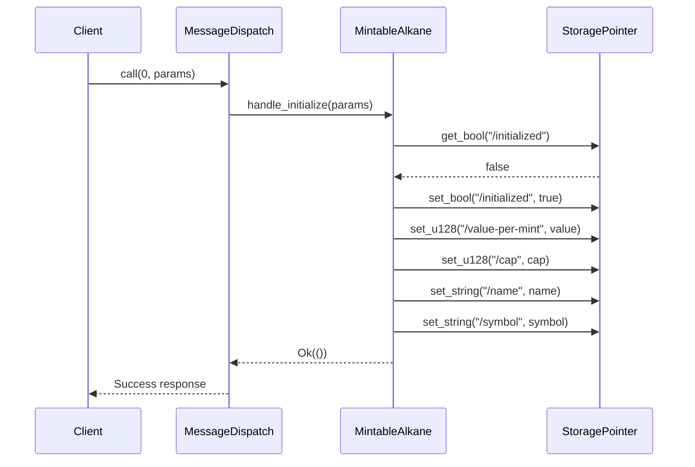
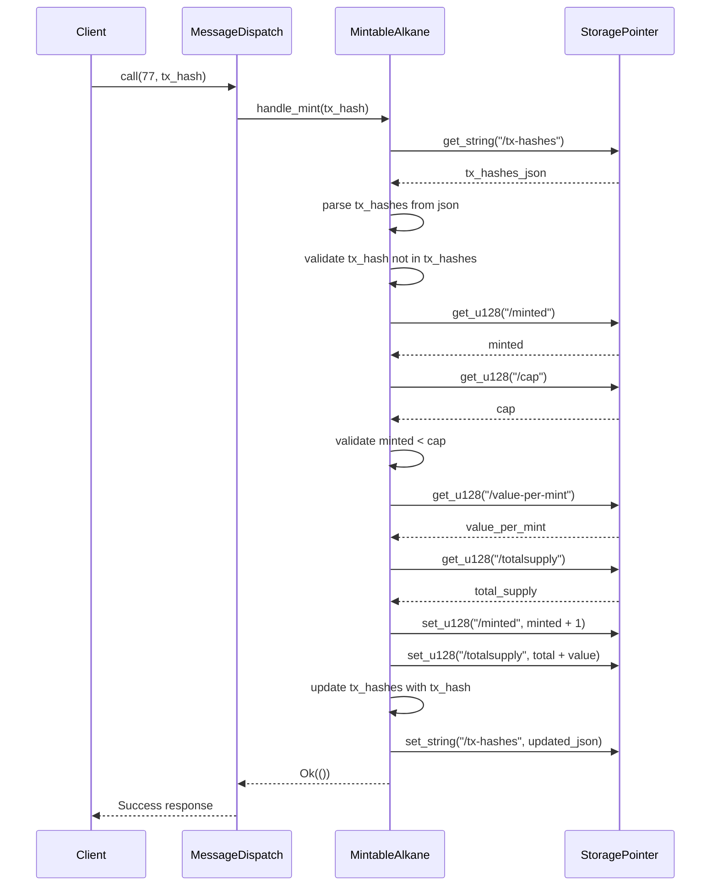

# Bitcoin Smart Contract Architectural Patterns

## System Architecture Overview

The Bitcoin smart contract architecture is built around a monolithic WebAssembly module that uses opcode-based message dispatching. This architectural approach enables efficient deployment while maintaining a clean separation of concerns:

```
Bitcoin Smart Contract
├── Core Contract Implementation
│   ├── Message Dispatch System
│   ├── Token Logic Implementation
│   └── Storage Access Layer
├── Interface Layer
│   ├── Trait Definitions
│   └── Message Type Definitions
├── Security Layer
│   ├── Initialization Guards
│   ├── Transaction Validation
│   ├── Supply Constraints
│   └── Numeric Safety
└── WebAssembly Integration
    ├── Export Definitions
    ├── Memory Management
    └── Runtime Integration
```

## Core Architectural Patterns

### 1. Monolithic Contract Pattern

The contract follows a monolithic architecture where all functionality is contained within a single WebAssembly module:

- All operations are defined in one cohesive unit
- Different functions are distinguished by numeric opcodes
- Single deployment transaction simplifies on-chain management
- Clean internal separation maintains code organization

**Implementation Structure:**
```rust
// Single implementation structure containing all functionality
pub struct MintableAlkane {
    // State variables are typically minimal as storage is delegated
}

// Single message enum defines all possible operations
#[derive(MessageDispatch)]
enum MintableAlkaneMessage {
    #[opcode(0)]
    Initialize { /* params */ },
    
    #[opcode(77)]
    Mint { /* params */ },
    
    // Additional operations...
}
```

### 2. MessageDispatch Pattern

The cornerstone of the architecture is the MessageDispatch derive macro that handles opcode-based message routing:

- Each operation is defined as an enum variant with a specific opcode
- The macro generates dispatch code that maps numeric codes to functions
- Return types are explicitly specified using attributes
- Parameters are strongly typed and validated

**Key Components:**
```rust
#[derive(MessageDispatch)]
enum MintableAlkaneMessage {
    #[opcode(0)]
    Initialize { 
        units: u8, 
        value_per_mint: u128,
        cap: u128, 
        name: String, 
        symbol: String 
    },
    
    #[opcode(77)]
    Mint { tx_hash: String },
    
    #[opcode(88)]
    SetNameAndSymbol { name: String, symbol: String },
    
    #[opcode(99)]
    #[returns(String)]
    GetName {},
    
    #[opcode(100)]
    #[returns(String)]
    GetSymbol {},
    
    #[opcode(101)]
    #[returns(u128)]
    GetTotalSupply {},
    
    #[opcode(102)]
    #[returns(u128)]
    GetValuePerMint {},
    
    #[opcode(103)]
    #[returns(u128)]
    GetMinted {},
    
    #[opcode(104)]
    #[returns(u128)]
    GetCap {},
    
    #[opcode(1000)]
    #[returns(Option<String>)]
    GetData { key: String },
}
```

**Dispatch Implementation Flow:**
1. WebAssembly runtime calls the entry point with an opcode
2. MessageDispatch macro routes to the appropriate handler
3. Parameters are deserialized from the input
4. Method is invoked with typed parameters
5. Result is serialized for WebAssembly return

### 3. Storage Pattern

The contract implements a structured storage approach using storage pointers:

- Each data element has a well-defined storage path
- Consistent naming conventions for storage paths
- Serialization/deserialization of complex structures
- Clear separation between different data elements

**Standard Storage Paths:**
```rust
// Token identity storage
storage::get_string("/name").unwrap_or_default()
storage::get_string("/symbol").unwrap_or_default()

// Numeric state storage
storage::get_u128("/totalsupply").unwrap_or(0)
storage::get_u128("/minted").unwrap_or(0)
storage::get_u128("/value-per-mint").unwrap_or(0)
storage::get_u128("/cap").unwrap_or(0)

// Complex data storage
let tx_hashes_json = storage::get_string("/tx-hashes").unwrap_or_default();
let tx_hashes: HashSet<String> = if tx_hashes_json.is_empty() {
    HashSet::new()
} else {
    serde_json::from_str(&tx_hashes_json).unwrap_or_default()
};

// Guard flags
storage::get_bool("/initialized").unwrap_or(false)
```

### 4. Security Patterns

#### 4.1 Initialization Guard Pattern

The contract uses an initialization guard to prevent multiple initializations:

```rust
fn observe_initialization() -> Result<(), &'static str> {
    if storage::get_bool("/initialized").unwrap_or(false) {
        return Err("Already initialized");
    }
    storage::set_bool("/initialized", true);
    Ok(())
}
```

This pattern ensures:
- The contract can only be initialized once
- All required setup happens in a single atomic operation
- Descriptive error messages provide clear feedback

#### 4.2 Transaction Hash Tracking Pattern

The contract implements a robust transaction hash tracking system:

```rust
fn validate_and_track_transaction(tx_hash: &str) -> Result<(), &'static str> {
    // Retrieve the current set of transaction hashes
    let tx_hashes_json = storage::get_string("/tx-hashes").unwrap_or_default();
    let mut tx_hashes: HashSet<String> = if tx_hashes_json.is_empty() {
        HashSet::new()
    } else {
        serde_json::from_str(&tx_hashes_json).unwrap_or_default()
    };
    
    // Check if this transaction hash has been used
    if tx_hashes.contains(tx_hash) {
        return Err("Transaction hash already used");
    }
    
    // Add the transaction hash to the set
    tx_hashes.insert(tx_hash.to_string());
    
    // Store the updated set
    let updated_json = serde_json::to_string(&tx_hashes)
        .map_err(|_| "Failed to serialize transaction hashes")?;
    storage::set_string("/tx-hashes", &updated_json);
    
    Ok(())
}
```

This pattern ensures:
- Each transaction can only be used once for minting
- Replay attacks are prevented
- The state is consistently updated

#### 4.3 Supply Cap Enforcement Pattern

The contract enforces supply constraints through validation:

```rust
fn validate_cap(minted: u128, cap: u128) -> Result<(), &'static str> {
    if cap > 0 && minted >= cap {
        return Err("Maximum supply cap reached");
    }
    Ok(())
}
```

This pattern ensures:
- Total supply cannot exceed configured cap
- Clear error messages explain constraint violations
- Zero cap value allows for unlimited supply

#### 4.4 Overflow Protection Pattern

The contract implements overflow checks for all numeric operations:

```rust
fn safe_add(a: u128, b: u128) -> Result<u128, &'static str> {
    a.checked_add(b).ok_or("Numeric overflow")
}
```

This pattern ensures:
- All arithmetic operations are safe from overflow
- Descriptive error messages explain failures
- Contract state remains consistent even with extreme values

### 5. Trait-Based Interface Pattern

The contract separates interface from implementation using traits:

```rust
// The trait defines the interface
pub trait MintableToken {
    fn name(&self) -> String;
    fn symbol(&self) -> String;
    fn total_supply(&self) -> u128;
    fn get_data(&self, key: &str) -> Option<String>;
    fn observe_initialization(&self) -> Result<(), &'static str>;
    // Other interface methods...
}

// The implementation fulfills the interface
impl MintableToken for MintableAlkane {
    fn name(&self) -> String {
        storage::get_string("/name").unwrap_or_default()
    }
    
    fn symbol(&self) -> String {
        storage::get_string("/symbol").unwrap_or_default()
    }
    
    // Other implementation methods...
}
```

This pattern ensures:
- Clear separation between interface and implementation
- Consistent method signatures across implementations
- Possibility for alternative implementations
- Support for polymorphic usage

## Advanced Architectural Patterns

### 1. WebAssembly Export Pattern

The contract exports its functionality through WebAssembly exports:

```rust
// Entry point for WebAssembly
#[no_mangle]
pub extern "C" fn call(opcode: i32, bytes: *mut u8, bytes_len: usize) -> *mut u8 {
    // MessageDispatch handles the routing based on opcode
    MintableAlkane::default().dispatch(opcode, bytes, bytes_len)
}
```

This pattern ensures:
- Single entry point for all contract operations
- Standardized parameter passing
- Compatible memory model with WebAssembly
- Consistent return value handling

### 2. View Function Pattern

The contract implements view functions as read-only operations:

```rust
#[opcode(99)]
#[returns(String)]
GetName {},

#[opcode(100)]
#[returns(String)]
GetSymbol {},

// Implementation
fn handle_get_name(&self) -> String {
    self.name()
}

fn handle_get_symbol(&self) -> String {
    self.symbol()
}
```

This pattern ensures:
- Clear separation between state-changing and read-only operations
- Explicit return type declaration
- No state modification in view functions
- Consistent opcode numbering convention (99-104 for view functions)

### 3. Error Handling Pattern

The contract uses Result types for error handling:

```rust
fn mint(&mut self, tx_hash: &str) -> Result<(), &'static str> {
    // Validate transaction hash
    self.validate_and_track_transaction(tx_hash)?;
    
    // Get current values
    let value_per_mint = self.value_per_mint();
    let minted = self.minted();
    let cap = self.cap();
    
    // Validate cap
    self.validate_cap(minted, cap)?;
    
    // Update state
    let new_minted = minted.checked_add(1).ok_or("Minted overflow")?;
    storage::set_u128("/minted", new_minted);
    
    // Update total supply
    let total = self.total_supply();
    let new_total = total.checked_add(value_per_mint).ok_or("Total supply overflow")?;
    storage::set_u128("/totalsupply", new_total);
    
    Ok(())
}
```

This pattern ensures:
- Early returns when errors are detected
- Clear error messages for debugging
- Error propagation through the call stack
- Consistent validation before state changes

## Integration Patterns

### 1. Factory Integration Pattern

The contract implements standardized traits for factory compatibility:

```rust
// Factory creates tokens that implement this trait
pub trait MintableToken {
    fn name(&self) -> String;
    fn symbol(&self) -> String;
    fn total_supply(&self) -> u128;
    fn get_data(&self, key: &str) -> Option<String>;
    fn observe_initialization(&self) -> Result<(), &'static str>;
}

// Contract implementation must fulfill the trait
impl MintableToken for MintableAlkane {
    // Implementation of trait methods
}
```

This pattern ensures:
- Compatibility with token factory systems
- Standardized interface for token operations
- Clear contract capabilities definition
- Support for contract creation through factories

### 2. Opcode Interface Pattern

The contract exposes a standardized opcode interface:

- Standard operations (0, 77, 88, 99-101, 1000)
- Contract-specific operations (102-104)
- Consistent parameter formats
- Explicit return type specifications

This pattern ensures:
- Interoperability with existing systems
- Consistent interface across different contracts
- Clear operation signatures
- Compatibility with tools and libraries

## Testing Patterns

### 1. Test Isolation Pattern

WebAssembly tests require proper isolation since storage is effectively global. The prefixed path pattern ensures tests don't interfere with each other:

```rust
// A test wrapper for isolation
struct TestVault {
    prefix: String,
}

impl TestVault {
    fn new(test_name: &str) -> Self {
        Self {
            prefix: format!("/test/{}", test_name),
        }
    }

    fn get_prefixed_path(&self, key: &str) -> String {
        format!("{}{}", self.prefix, key)
    }
    
    // Storage access methods that use prefixed paths
    fn name_pointer(&self) -> StoragePointer {
        StoragePointer::from_keyword(&self.get_prefixed_path("/name"))
    }
    
    // Implement functionality using isolated storage paths
}

#[test]
#[wasm_bindgen_test]
fn test_initialization() {
    // Each test gets its own isolated vault instance
    let vault = TestVault::new("init_test");
    
    // Test uses isolated storage
    assert_eq!(vault.name_pointer().get().len(), 0);
}
```

This pattern ensures:
- Each test has a completely isolated storage area
- Tests can run in parallel without interference
- Storage collisions are eliminated
- More realistic simulation of production behavior

### 2. Dual Test Runner Pattern

Tests should support both standard Rust test runner and WebAssembly test runner:

```rust
// Supports both standard Rust tests and WASM tests
#[test]                 // For standard Rust test runner
#[wasm_bindgen_test]    // For WebAssembly test runner
fn test_functionality() {
    // Test code...
}
```

This enables:
- Local development with fast test cycles
- WebAssembly validation for production behavior
- CI/CD pipeline flexibility
- Testing in multiple environments

### 3. Component Testing Pattern

The contract can be tested at the component level:

```rust
#[test]
fn test_initialization() {
    let mut token = MintableAlkane::default();
    
    // Initialize the token
    let result = token.initialize(18, 1000, 1000000, "Test Token", "TST");
    assert!(result.is_ok());
    
    // Check the initialized state
    assert_eq!(token.name(), "Test Token");
    assert_eq!(token.symbol(), "TST");
    assert_eq!(token.cap(), 1000000);
    assert_eq!(token.value_per_mint(), 1000);
}
```

### 4. Transaction Validation Testing Pattern

The contract can be tested for transaction validation:

```rust
#[test]
fn test_transaction_validation() {
    let mut token = MintableAlkane::default();
    token.initialize(18, 1000, 1000000, "Test Token", "TST").unwrap();
    
    // First mint with a transaction should succeed
    let result1 = token.mint("tx1");
    assert!(result1.is_ok());
    
    // Second mint with the same transaction should fail
    let result2 = token.mint("tx1");
    assert!(result2.is_err());
    
    // Mint with a new transaction should succeed
    let result3 = token.mint("tx2");
    assert!(result3.is_ok());
}
```

### 5. Cap Enforcement Testing Pattern

The contract can be tested for cap enforcement:

```rust
#[test]
fn test_cap_enforcement() {
    let mut token = MintableAlkane::default();
    token.initialize(18, 1000, 2, "Test Token", "TST").unwrap();
    
    // First mint should succeed
    assert!(token.mint("tx1").is_ok());
    
    // Second mint should succeed
    assert!(token.mint("tx2").is_ok());
    
    // Third mint should fail due to cap
    assert!(token.mint("tx3").is_err());
}
```

### 6. Error Propagation Pattern

For proper error handling in tests, errors should be mapped to a common error type:

```rust
#[test]
#[wasm_bindgen_test]
fn test_with_error_handling() -> Result<()> {
    let vault = TestVault::new("error_test");
    
    // Map string errors to anyhow errors
    vault.observe_initialization().map_err(anyhow::Error::msg)?;
    
    // Test functionality
    Ok(())
}
```

This pattern ensures:
- Consistent error handling across tests
- Proper propagation of errors
- Clear error messages in test failures
- Compatibility with the Result-based test pattern

## Deployment Considerations

### 1. WebAssembly Compilation

The contract must be compiled to WebAssembly for deployment:

```toml
[lib]
crate-type = ["cdylib", "rlib"]
```

### 2. Initialization Sequence

The contract must be initialized after deployment:

1. Deploy the WebAssembly module
2. Call the `Initialize` method with appropriate parameters:
   - Token units (e.g., 18 for 18 decimal places)
   - Value per mint (e.g., 1000 for 1000 tokens per mint)
   - Supply cap (e.g., 1000000 for a cap of 1 million tokens, 0 for unlimited)
   - Name and symbol

### 3. Opcode Usage

Clients interact with the contract through opcodes:
- `0`: Initialize the contract
- `77`: Mint tokens
- `88`: Set name and symbol
- `99-104`: View functions
- `1000`: Get custom data

## Architectural Decision Records

### ADR-1: Monolithic vs. Multi-Contract Architecture

**Context:** The contract architecture needed to balance simplicity, security, and flexibility.

**Decision:** Adopt a monolithic architecture with a single WebAssembly module.

**Rationale:**
- Simpler deployment process with a single transaction
- Lower on-chain storage requirements
- Easier state management without cross-contract calls
- Cleaner security model with unified validation

**Consequences:**
- All functionality must fit within a single contract
- Upgrades require full contract replacement
- Clear internal separation becomes more important

### ADR-2: MessageDispatch for Opcode Routing

**Context:** The contract needed a clean way to route messages based on opcodes.

**Decision:** Use the MessageDispatch derive macro for opcode-based routing.

**Rationale:**
- Automatic code generation reduces boilerplate
- Strong type safety for parameters and return values
- Clear mapping between opcodes and functions
- Consistent error handling across operations

**Consequences:**
- All external interactions must go through the dispatch system
- Return types must be explicitly specified
- All operations must have unique opcode values

### ADR-3: Transaction Hash Tracking for Mint Limits

**Context:** The contract needed to enforce one mint per transaction.

**Decision:** Implement transaction hash tracking using a HashSet and storage.

**Rationale:**
- Cryptographic guarantee against replay attacks
- Efficient validation using HashSet containment checks
- Persistent tracking across contract invocations
- Clear error messages for validation failures

**Consequences:**
- Storage grows with the number of mint transactions
- Serialization/deserialization overhead for the hash set
- Need for efficient HashSet implementation

## Component Interactions

### Initialization Flow



### Mint Flow



### View Function Flow

```mermaid
sequenceDiagram
    participant Client
    participant Dispatcher as MessageDispatch
    participant Contract as MintableAlkane
    participant Storage as StoragePointer

    Client->>Dispatcher: call(99, params)
    Dispatcher->>Contract: handle_get_name()
    Contract->>Storage: get_string("/name")
    Storage-->>Contract: token_name
    Contract-->>Dispatcher: token_name
    Dispatcher-->>Client: token_name
